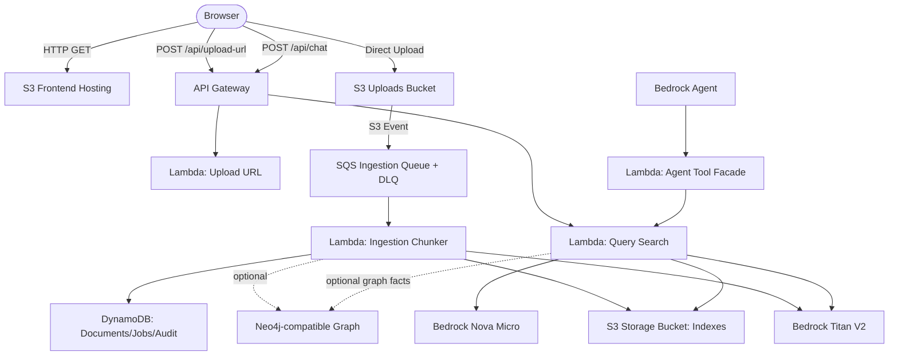

# AWS Serverless GraphRAG Platform Prototype

A mostly serverless Retrieval-Augmented Generation (RAG) and GraphRAG prototype deployed on AWS using local Terraform. It aligns to a React/Python/AWS/Bedrock/knowledge-graph architecture without introducing always-on compute in the default path.

The default deployment uses S3, API Gateway, Lambda, SQS, DynamoDB, and Bedrock. Neo4j-compatible GraphRAG is optional: leave `neo4j_uri` empty for no-op graph mode, use local Neo4j/AuraDB Free for demos, or attach a paid Neo4j Aura Professional instance only when needed.

**Cost posture:** near-zero idle AWS cost for prototype usage, usually around **US$0-$1/month idle**, **US$1-$5/month light demo**, and **US$5-$20/month active interview demo**, excluding optional paid Neo4j and custom domains.

---

## 🌟 Quick Repository Tour (3-Minute Skim)

*   **System Architecture & Flow**: Detailed diagram and data pipeline description in [docs/architecture.md](file:///Users/xavier/src/rag/docs/architecture.md).
*   **Engineering Trade-offs & Scaling Roadmap**: Why we chose S3 vector storage over OpenSearch, and how to scale to millions of documents in [docs/design-decisions.md](file:///Users/xavier/src/rag/docs/design-decisions.md).
*   **observability, Security, & Operational Runbooks**: CloudWatch logging, IAM boundaries, cost safeguards, and failover designs in [docs/operational-considerations.md](file:///Users/xavier/src/rag/docs/operational-considerations.md).
*   **Infrastructure as Code (IaC)**: Standard Terraform resource configuration in [terraform/main.tf](file:///Users/xavier/src/rag/terraform/main.tf).
*   **Vector Search & Generation Handler**: Embedded similarity search and Bedrock grounding prompts in [lambda/query/index.py](file:///Users/xavier/src/rag/lambda/query/index.py).
*   **Paragraph-Aware Ingest Handler**: Parsing, chunking, and embedding creation in [lambda/ingest/index.py](file:///Users/xavier/src/rag/lambda/ingest/index.py).

---

## 🏗️ Architecture & Component Overview

The system runs entirely on AWS serverless resources, eliminating compute billing during idle periods.



### AWS Services Utilized:
*   **Amazon S3**: Hosts static frontend assets (HTML, CSS, JS) and serves as the decentralized vector database storing `.json` files.
*   **AWS Lambda**: Executes core operations (S3 URL generation, paragraph chunking, in-memory vector search, document listings, and Bedrock Agent action tools).
*   **Amazon SQS**: Decouples S3 upload events from ingestion and provides DLQ-backed retry behavior.
*   **Amazon DynamoDB**: Stores document/job/audit metadata using on-demand billing.
*   **Amazon API Gateway (HTTP API)**: Exposes endpoints and manages CORS configurations.
*   **Amazon Bedrock**:
    *   `amazon.titan-embed-text-v2:0` (512-dimension unit vector embeddings).
    *   `amazon.nova-micro-v1:0` (Ultra-low latency LLM generation).
*   **AWS Service Catalog AppRegistry**: Registers all project resources under the AWS Console's **My Applications** dashboard.
*   **Neo4j-compatible GraphRAG**: Optional repository abstraction for AuraDB Free/local Neo4j. Empty Neo4j variables keep the graph path disabled with no runtime dependency.

---

## 📂 Repository Directory Structure

```
├── frontend/                  # Single-Page Web App UI Assets
│   ├── index.html             # Glassmorphism double-pane dashboard layout
│   ├── style.css              # Custom styling, dark-mode, animations, scrollbars
│   └── app.js                 # Presigned uploading, polling, and conversation state
├── lambda/                    # Python AWS Lambda microservices
│   ├── upload/                # Generates S3 presigned URLs for direct client uploads
│   ├── ingest/                # S3 trigger parsing documents, paragraph-chunking, and embedding
│   ├── query/                 # Vector embeddings generator, local ranker, graph context, and Bedrock LLM caller
│   ├── agent_tool/            # Bedrock-Agent-compatible action group Lambda facade
│   ├── shared/                # Shared response, DynamoDB, and GraphRAG repository helpers
│   └── list_docs/             # Document indexing list directory and file deletion processing
├── terraform/                 # Infrastructure as Code
│   ├── main.tf                # Storage, compute, IAM roles, API Gateway, and AppRegistry
│   ├── variables.tf           # Regional settings and Bedrock Model configurations
│   └── outputs.tf             # Outputs API Gateway URL, S3 URL, and bucket names
├── scripts/                   # Automations & utility scripts
│   ├── package_lambdas.py     # Bundles python Lambda source and dependencies (pypdf) into ZIPs
│   ├── upload_frontend.py     # Syncs frontend directory directly to S3 Hosting bucket
│   └── upload_samples.py      # Uploads sample datasets to test ingestion pipeline
├── sample_data/               # Pre-packaged plain text datasets to seed knowledge base
└── docs/                      # Architectural, Design, and Operational runbooks
```

---

## ⚡ Key Technical Features

1.  **Paragraph-Aware Chunking**: To ensure highly accurate vector matching, [lambda/ingest/index.py](file:///Users/xavier/src/rag/lambda/ingest/index.py) chunks documents on double newlines (`\n\n`) to keep logical statements (like paragraph points or FAQ entries) intact. This prevents short sentences from being semantically diluted within large blocks.
2.  **Decentralized S3 Vector Indexing**: To prevent concurrent file uploads from creating write locks or race conditions on a monolithic database, the system outputs an independent index under `indexes/{filename}.json`.
3.  **In-Memory Retrieval ranking**: The query function downloads index files from S3, checks updates using ETags, and calculates dot-product similarity (since Titan V2 vectors are normalized, dot product equals Cosine Similarity) in less than 5ms.
4.  **"Absolute Truth" Grounding Guardrails**: The LLM prompt forces the model to treat context facts as absolute truth, preventing LLM skepticism and ensuring direct, factual answers without hallucination.

---

## 💸 Cost Posture ($0/month Idle Cost)

| Mode | Usage Detail | Daily Cost |
| :--- | :--- | :--- |
| Mode | Usage Detail | Approx Monthly Cost |
| :--- | :--- | :--- |
| **Idle** | Stack deployed, no requests. Small residual storage/log costs only. | **US$0-$1** |
| **Light demo** | Occasional uploads and Q&A, small knowledge base, Nova Micro/Titan embeddings. | **US$1-$5** |
| **Active interview demo** | Regular uploads and Q&A during demonstrations. | **US$5-$20** |
| **Optional Neo4j paid** | AuraDB Professional instead of AuraDB Free/local Neo4j. | Adds roughly **US$65+/month** |

---

## 🚀 Getting Started & Deployment

### Prerequisites:
*   AWS CLI configured with credentials in `us-east-1`.
*   Access enabled for **Titan Text Embeddings V2** and **Nova Micro** in AWS console (Bedrock -> Model Access).
*   Terraform installed locally.
*   Python 3.12+ installed locally.

### Deployment Steps:
1.  **Clone the repository**:
    ```bash
    git clone https://github.com/hanxuema/awsrag.git && cd awsrag/terraform
    ```
2.  **Package the Lambda Zip files**:
    ```bash
    python3 ../scripts/package_lambdas.py
    ```
3.  **Review Terraform plan locally**:
    ```bash
    terraform plan
    ```
4.  **Deploy via Terraform only after explicit confirmation**:
    ```bash
    terraform apply
    ```
5.  **Access the Portal**: Copy the S3 `website_url` output from Terraform and paste it into your browser.

Codex should not run `terraform apply` for this repo without explicit confirmation.

---

## 🔒 Security & Observability

*   **Least Privilege IAM**: All compute execution policies restrict S3 accesses to specific ARNs (no wildcards) and limit Bedrock to invoke model APIs only.
*   **S3 Public Access Blocks**: The uploads bucket blocks all public bucket policies and ACLs.
*   **observability**: Logging is captured automatically in AWS CloudWatch Log Groups under `/aws/lambda/serverless-rag-*`.

---

## 📝 Project Ownership Statement

**This project was designed, implemented, and configured 100% by the author.** 
*   **Infrastructure**: Wrote the complete Terraform configurations, establishing CORS rules, IAM policies, and API Gateway mapping.
*   **Backend Functions**: Implemented the chunking algorithms, similarity search scoring, S3 integration, and Bedrock model payload routing.
*   **Frontend**: Designed the responsive dashboard and integrated the REST query APIs.
