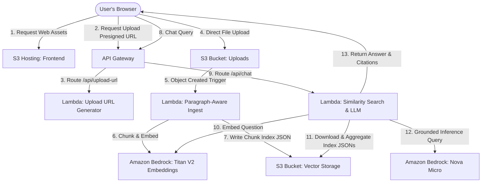

# System Architecture

This document describes the end-to-end system architecture of the AWS Serverless RAG (Retrieval-Augmented Generation) system.

---

## Architecture Diagram

The entire system runs on AWS serverless primitives, ensuring high availability, zero idle costs, and automatic scaling.

---

## 1. Document Ingestion Pipeline

The ingestion pipeline is asynchronous, event-driven, and processes documents as they are uploaded.

### Ingestion Flow:
1.  **File Upload**: The client requests a secure presigned upload URL from `POST /api/upload-url` (handled by [lambda/upload/index.py](file:///Users/xavier/src/rag/lambda/upload/index.py)). The user's browser then uploads the document (TXT, MD, or PDF) directly to the `Uploads` S3 bucket.
2.  **S3 Notification Trigger**: An S3 `s3:ObjectCreated:*` event triggers [lambda/ingest/index.py](file:///Users/xavier/src/rag/lambda/ingest/index.py) asynchronously.
3.  **Extraction & Parsing**: The ingestion function downloads the document to `/tmp`. If the file is a PDF, it parses it using `pypdf`. For plain text or markdown files, it reads the content directly.
4.  **Paragraph-Aware Chunking**: To prevent semantic dilution, the text is split into logical chunks using a double newline (`\n\n`) paragraph delimiter. Paragraphs that exceed the target block size (600 characters) are split on sentence boundaries.
5.  **Vector Embeddings**: Each text chunk is sent to **Amazon Bedrock** using the `amazon.titan-embed-text-v2:0` embedding model, returning a 512-dimension unit vector.
6.  **Decentralized Vector Storage**: The chunks and their vector embeddings are stored in a dedicated JSON file under `indexes/{filename}.json` in the `Storage` S3 bucket. Storing one index file per document prevents write locks and race conditions during concurrent uploads.

---

## 2. Retrieval & Generation Pipeline

The query pipeline runs synchronously via API Gateway, executing similarity search in memory and retrieving context for LLM generation.

### Retrieval & Generation Flow:
1.  **Chat Request**: The client sends a REST request to `POST /api/chat` (handled by [lambda/query/index.py](file:///Users/xavier/src/rag/lambda/query/index.py)) containing the search query, target `top_k`, and LLM `temperature`.
2.  **Query Embedding**: The query Lambda converts the search query into a 512-dimension vector using `amazon.titan-embed-text-v2:0` on Amazon Bedrock.
3.  **In-Memory Search**:
    *   The Lambda function lists and downloads all document index files from the S3 storage bucket under `indexes/`.
    *   It caches the indices in global execution context memory using S3 ETags to check for updates.
    *   For each vector chunk, it calculates the dot-product similarity against the query vector (since Titan V2 embeddings are normalized to unit length, the dot product is equivalent to Cosine Similarity).
    *   It ranks all chunks and selects the `top_k` most relevant matches.
4.  **Grounded Prompt Generation**: The function constructs a structured prompt containing the user's query and the matching text chunks. The system prompt instructs the model to treat all statements in the context as absolute truth and to state `"I cannot find the answer in the provided context"` only if no matching data is found.
5.  **Inference**: The prompt is sent to **Amazon Bedrock** using `amazon.nova-micro-v1:0` (or `anthropic.claude-3-haiku-20240307-v1:0` depending on configuration).
6.  **Structured Response**: The API returns the generated answer alongside details of the retrieved chunks (filename, snippet, and similarity score) to enable citation rendering in the client.

---

## 3. Infrastructure & Deployment Setup

The infrastructure is defined as code in [terraform/main.tf](file:///Users/xavier/src/rag/terraform/main.tf).

### Key Infrastructure Components:
*   **S3 Static Website Hosting**: The `Storage` S3 bucket hosts static frontend assets ([index.html](file:///Users/xavier/src/rag/frontend/index.html), [style.css](file:///Users/xavier/src/rag/frontend/style.css), [app.js](file:///Users/xavier/src/rag/frontend/app.js)). A dynamically generated `config.js` is uploaded by Terraform containing the active API Gateway endpoint.
*   **API Gateway (HTTP API)**: Routes incoming HTTP requests (`/api/*`) directly to the corresponding Lambda integrations, managing CORS configuration globally.
*   **IAM Least Privilege Roles**: The Lambdas share an execution role ([lambda_role](file:///Users/xavier/src/rag/terraform/main.tf#L84-L97)) with permissions restricted to only S3 bucket operations, Bedrock invocation, and CloudWatch log groups.
*   **AWS Service Catalog AppRegistry**: Grouping resource ([aws_servicecatalogappregistry_application](file:///Users/xavier/src/rag/terraform/main.tf#L380-L387)) which registers all project resources in the AWS Console under **My Applications** for centralized management and monitoring.
