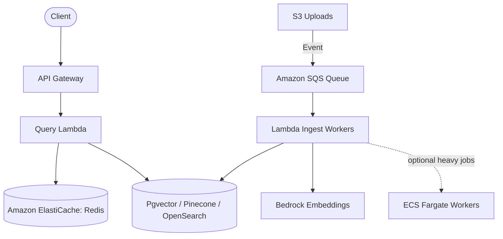

# Engineering Design Decisions & Trade-offs

This document details the architectural choices, trade-offs, and design patterns selected for the AWS Serverless RAG system, along with considerations for production scaling.

---

## 1. Why Serverless & AWS Lambda?

The key driver for this architecture is **cost-efficiency for prototype and low-traffic environments**.

*   **Near-Zero Idle Cost**: Traditional vector databases and hosting setups (like Amazon OpenSearch Serverless, EC2, or always-on ECS services) run constantly. This default architecture uses S3, API Gateway, Lambda, SQS, DynamoDB on-demand, and Bedrock, so compute cost scales down to zero when idle. Small storage/log charges may still appear, so the practical idle estimate is **US$0-$1/month** rather than a hard `$0`.
*   **Automatic Scaling**: Compute scales instantly with demand. If no documents are being uploaded or queries made, zero compute runs. If thousands of requests arrive, AWS Lambda dynamically scales out instances to meet demand.
*   **Reduced Operational Overhead**: There are no operating systems, Docker containers, Kubernetes nodes, or database clusters to patch, upgrade, or monitor.

---

## 2. Why an S3-Backed Vector Index?

Instead of using a dedicated vector database (such as Pinecone, Milvus, or Pgvector), this prototype stores vectors and metadata as decentralized JSON files inside Amazon S3, performing retrieval in-memory inside the query Lambda.

### The Problem with Dedicated Vector DBs:
*   **Amazon OpenSearch Serverless**: Minimum cost is ~$700/month (4 OCUs).
*   **Pinecone (Serverless)**: While cost-effective, it introduces external dependency, API credential management, and networking out of AWS VPC.
*   **pgvector on RDS/Aurora**: Aurora Serverless v2 has a minimum runtime cost of ~$40/month.

### The S3 In-Memory Solution:
By writing the index for each document to S3 (e.g. `indexes/{filename}.json`) and aggregating them in-memory, we achieve:
1.  **Zero cost** (S3 storage is pennies per GB).
2.  **No concurrency race conditions**: Using a monolithic `index.json` file would create write collisions during parallel document uploads. Saving decentralized index files per document allows concurrent, independent writes.
3.  **High performance for small-to-medium datasets**: Loading 10-100 index files (each ~50KB) takes under 150ms in a Lambda function. In-memory matrix calculation of dot-product similarity (512-dimension vectors) takes less than 5ms for thousands of vectors.

---

## 3. Trade-offs & Alternatives Considered

| Decision Area | Selected Approach | Alternative Considered | Trade-off / Rationale |
| :--- | :--- | :--- | :--- |
| **Vector DB** | S3 In-Memory Search | Amazon OpenSearch Serverless | **S3 In-Memory**: Extremely cheap, simple. But does not scale beyond ~10,000 document chunks due to Lambda memory limits and download latency.   **OpenSearch**: Scales to millions of chunks, but costs $700+/month. Chosen S3 for prototyping. |
| **Model Inferences** | Bedrock Nova Micro | Bedrock Claude 3 Haiku | **Nova Micro**: 10x cheaper than Claude 3 Haiku, faster responses, sufficient for simple QA.   **Claude**: Highly intelligent, but higher cost and latency. We support both via configuration, defaulting to Nova Micro for cost control. |
| **Chunking Strategy** | Paragraph-Aware | Fixed Character Chunks | **Paragraph-Aware**: Keeps semantic paragraphs intact, preventing dilution of specific statements.   **Fixed-Character**: Simpler, but cuts words in half and merges unrelated statements, reducing similarity accuracy. |
| **Ingestion Trigger** | S3 → SQS → Lambda | Direct S3 → Lambda | **SQS**: Adds DLQ-backed retry behavior and decouples uploads from ingestion. Direct Lambda trigger is cheaper by a tiny amount but weaker operationally. |
| **Metadata Store** | DynamoDB on-demand | S3 metadata only | **DynamoDB**: Demonstrates NoSQL design and gives reliable document/job state without idle compute. |
| **GraphRAG** | Optional Neo4j-compatible repository | Mandatory managed graph DB | **Optional**: Keeps default cost near zero. Local Neo4j or AuraDB Free can demonstrate graph retrieval; paid Aura is opt-in. |
| **Containers** | Optional ECS roadmap only | Default ECS/Fargate API | **Serverless default**: ECS is useful to demonstrate container capability but conflicts with the "free when idle" goal if it runs continuously. |
| **Infrastructure** | Local Terraform | AWS CDK / CloudFormation / GitHub Actions | **Terraform**: Multi-cloud tool of choice for DevOps roles, declarative, and clear state management. Deployments are intentionally local/manual for this repo. |

---

## 4. Production-Scale Architectural Roadmap

To scale this prototype to support millions of documents and heavy enterprise workloads, the following changes would be made:

1.  **Migration to a Dedicated Vector DB**: Replace the S3 in-memory index scanner with **Amazon OpenSearch Serverless** or **RDS PostgreSQL (pgvector)** to enable indexing millions of documents with sub-10ms metadata filtering and index searching.
2.  **Asynchronous Ingestion Queuing**: S3 upload notifications now push tasks to **Amazon SQS**, processed by Lambda. For very large OCR/PDF workloads, ECS Fargate workers can be added as an optional paid path.
3.  **Caching Layer**: Implement **Amazon ElastiCache (Redis)** to cache query embeddings and frequent user queries, bypassing Bedrock API calls and database lookups to reduce response times to sub-50ms.
4.  **API Security**: Implement **Cognito User Pools** or **API Gateway API Keys** with AWS WAF to secure endpoints and prevent resource exhaustion.
